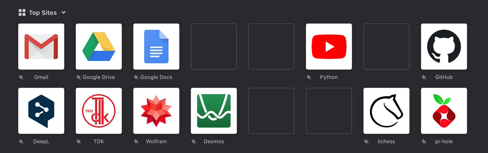

#Icons for Firefox Top Sites

Daha clean bir UI olsun diye kullaniyorum

`Topsites` > `Edit this site` > `Use a custom site...` > `Paste`

Paste driect link to image. 

```
https://raw.githubusercontent.com/KorayUlusan/Misc/master/Firefox/name.jpg
```

### Preview
 
<style> #topSitesPreview {border-radius: 10px;} </style>


## Make yours

Use the Photoshop template: [Firefox Top Sites Template.psd](https://github.com/KorayUlusan/Misc/blob/master/Firefox/template.psd)